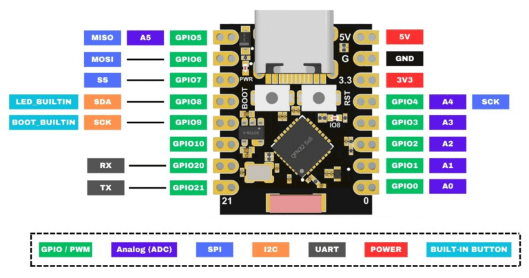
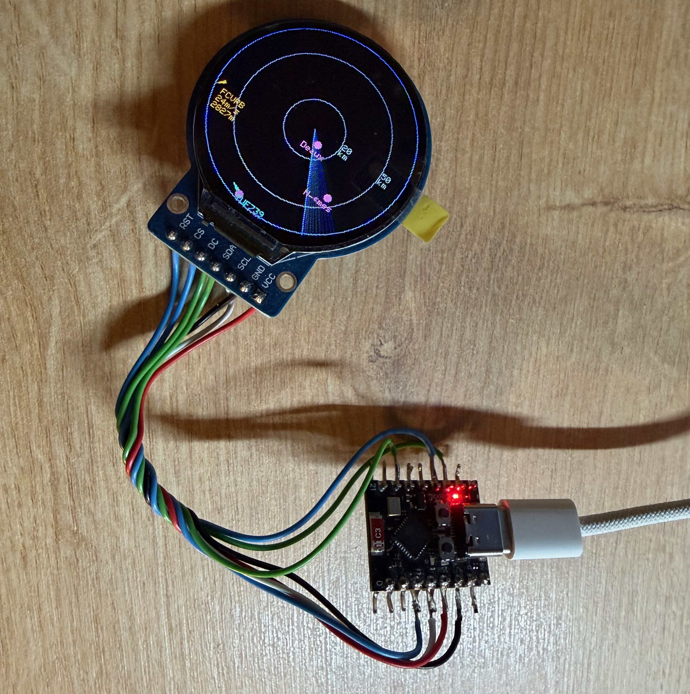

<h1 align=center>
  #+ FlyRadar

  

  FlyRadar est un fork du projet micro-radar d'AnthonySturdy (https://github.com/AnthonySturdy/micro-radar). J'ai adapté le projet au matériel dont je disposais et ajouté des options de personnalisation ainsi qu'une mise à jour du firmware par OTA (téléversement over-the-air).

  ## Matériel

  Le projet fonctionne avec un ESP32-C3 (super-mini) et un écran LCD 1,28" (GC9A01). Selon votre montage, quelques fils devront être soudés ou connectés avec des câbles Dupont.

  Pour le boîtier, j'ai imprimé les pièces en PLA. L'écran et la carte sont fixés à la colle chaude ; des vis M3x15 peuvent être ajoutées pour la finition.

  ### Outils nécessaires

  - Clé Allen 2,5 mm
  - Pistolet à colle chaude
  - Fer à souder (si vous choisissez l'option soudure)

  Attention : l'écran est fragile et sensible aux rayures.

  ### Liste de composants (exemples)

  - Écran 1.28" Round GC9A01 (IPS)
  - Carte ESP32-C3 (super-mini)
  - 4 vis M3x15

  Toute carte ESP32 peut convenir, mais le câblage peut différer selon le modèle et doit être adapté.

  ### Câblage (exemple)

  ESP32-C3 // LCD GC9A01

  - 3V3 → VCC
  - GND → GND
  - GPIO4 → SCL
  - GPIO5 → SDA
  - GPIO9 → DC
  - GPIO6 → CS
  - GPIO3 → RST
  
  

    
    
  

  ## Comptes / API

  Ce projet peut utiliser l'API OpenSky pour récupérer les données de vol. Créer un compte OpenSky est recommandé (gratuit) : le quota de requêtes passe d'environ 400 à ~4000 par jour, améliorant la précision et la réactivité de l'affichage en direct. Inscrivez-vous sur https://opensky-network.org.

  ## Développement et téléversement

  Installez Visual Studio Code et l'extension PlatformIO IDE. Ouvrez le projet dans VS Code ; PlatformIO installera automatiquement les dépendances.

  Branchez la carte via USB-C et téléversez depuis PlatformIO (bouton Upload). Si la carte ne redémarre pas automatiquement, maintenez `BOOT`, appuyez sur `RESET`, puis relâchez `BOOT`.

  ## Premier démarrage

  Au premier démarrage, la carte diffuse un point d'accès Wi‑Fi `FlyRadar-Setup`. Connectez-vous avec un appareil (téléphone ou ordinateur) : la page de configuration s'ouvrira automatiquement. Renseignez votre Wi‑Fi et sauvegardez : la carte redémarrera et se connectera au réseau.

  Si le point d'accès n'apparaît pas immédiatement, attendez 30 secondes et réessayez.

  ## Configuration

  Une fois connecté au réseau, la configuration est accessible depuis n'importe quel appareil à l'adresse : http://flyradar.local

  Options disponibles :

  - **Position** : latitude / longitude (centre du radar)
  - **Rayon du radar** : angle de balayage (en degrés)
  - **Options d'affichage** : activer/désactiver certains éléments visuels

  Si vous avez un compte OpenSky, renseignez vos identifiants dans la configuration pour bénéficier du quota étendu.

 
  ## Remarques

  - Ce projet a été réalisé comme un projet personnel et s'inspire de plusieurs créations comme indiqué au début.
  
